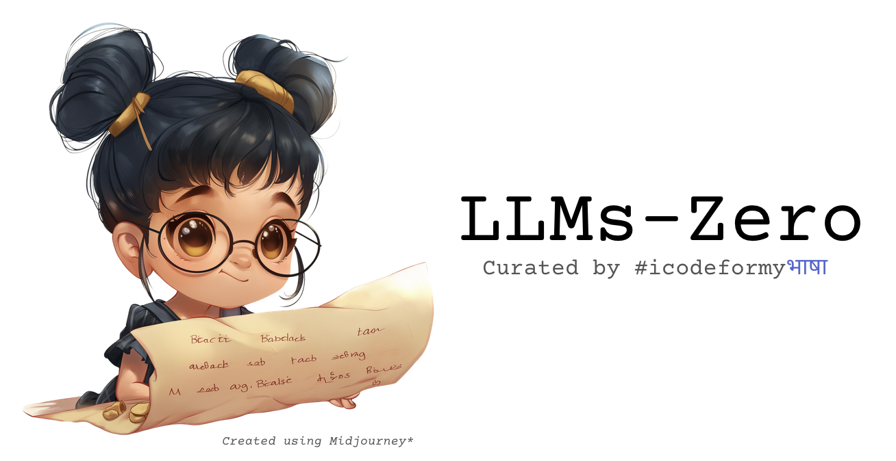

   
  Curated reading list for all things NLP and LLMs created while I am working on #icodeformyभाषा! 

### Large Language Models - A Curated Reading List
[Large Language Models - A Curated Reading List](llms-zero/llms_curated_list.md) - While I am working on the blog series on the LLaMA family of models, I have also put together a curated reading list of papers that chart the evolution of large language models. These papers provide crucial context for understanding the foundations of large language models and landscape of LLMs that led to development of systems like meta.ai, ChatGPT, and Claude, among others.

